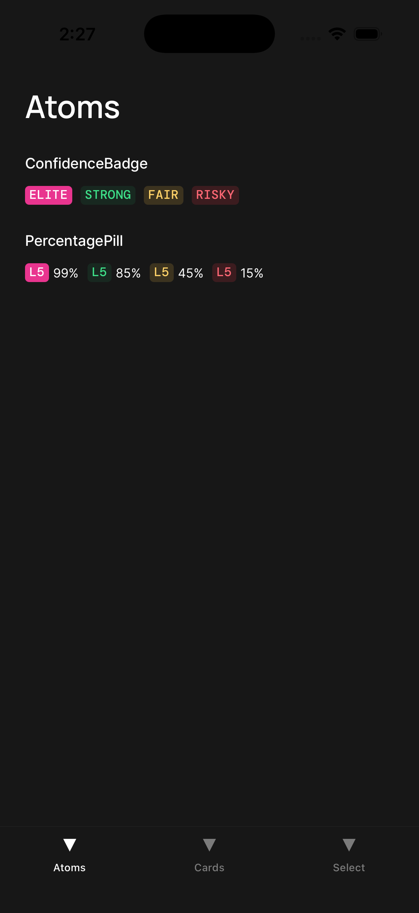
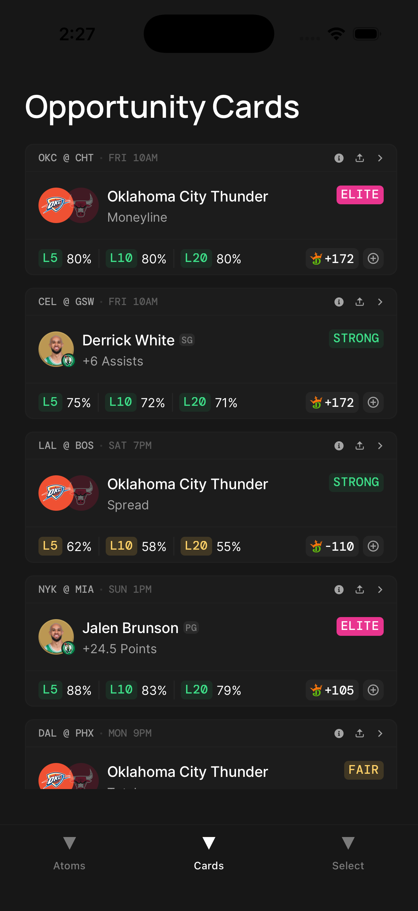
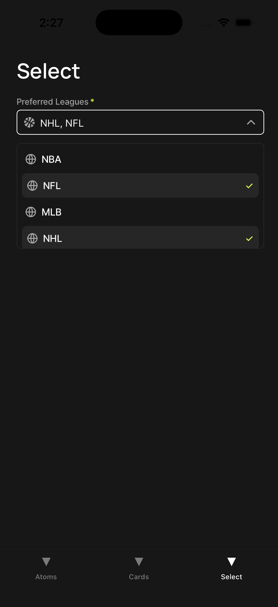

# Betaroo RN Test Task

React Native + TypeScript implementation of the Betaroo mobile test assignment.

## Demo & screenshots

<p align="center">
  <video controls playsinline preload="metadata" width="24%" style="max-width: 24%; vertical-align: top">
    <source
      src="https://raw.githubusercontent.com/ed-techy/betaroo-react-native/main/docs/demo.mp4"
      type="video/mp4"
    />
  </video>
  
  
  
</p>

`` looks like an image in Markdown, but MP4 is not an image—use the `<video>` player above instead. If it does not render (some viewers strip HTML), open [the raw MP4](https://raw.githubusercontent.com/ed-techy/betaroo-react-native/main/docs/demo.mp4) or [the file in the repo](docs/demo.mp4). The player uses the `main` branch; ensure `docs/demo.mp4` exists there after you merge and push.

## What Was Completed

1. **Opportunity Cards**
   - Built reusable card components (2 styles): `TeamOpportunityCard`, `PlayerOpportunityCard`
   - Built standalone atoms used by cards: `ConfidenceBadge`, `PercentagePill`
2. **Preferred Leagues Select**
   - Implemented all required states: default, focus/open, filled
   - Added transitions for open/close, select/deselect, and content state changes
3. **Token Refactor**
   - Refactored tokens into scalable primitives + semantic layers with typed exports

## How To Run

```bash
yarn install
yarn run ios
```

Alternative:

```bash
yarn start
```

## Navigation / Screens

The app is split into dedicated screens (tabs) for easier review:

- `Atoms`
- `Cards`
- `Select`

These are implemented in `app/(tabs)`.

## Key Implementation Decisions

- **No external UI libraries** for core components.
- **Functional components + hooks** throughout.
- **Styling with `StyleSheet.create`** and tokens.
- **Icons/logos**:
  - SVGs:
    - `components/icons/*`
    - `components/logos/*`
  - Added shared icon typing and barrel exports for consistency.
- **Cards screen UX**:
  - Rendered opportunity cards with mock data via scrollable `FlatList`
  - Added subtle mount + press animations to show interaction quality without over-animating.
- **Safe area compliance**:
  - Screen titles are rendered below the status bar using safe area wrappers.

## Token Architecture

```txt
tokens/
  index.ts
  primitives/
    colors.ts
    spacing.ts
    radius.ts
    shadows.ts
    typography.ts
  semantic/
    dark.ts
    light.ts
    index.ts
```

- `primitives`: raw scales and base values.
- `semantic`: theme-meaningful aliases (`background`, `text`, `border`, etc.).
- `index.ts`: stable public API for token imports.

## Documentation Assets

Screen recording and PNGs live under [`docs/`](docs/).

## If I Had More Time

- Add full dark/light theme switching demo screen.
- Expand team/logo registry and card mock data coverage for more sports/leagues.
- Add snapshot/UI tests for the card/select states.
- Tune motion timing values with iterative design QA pass on device.
- Add a small internal icon/logo generator script or lint rule to enforce icon folder conventions.
